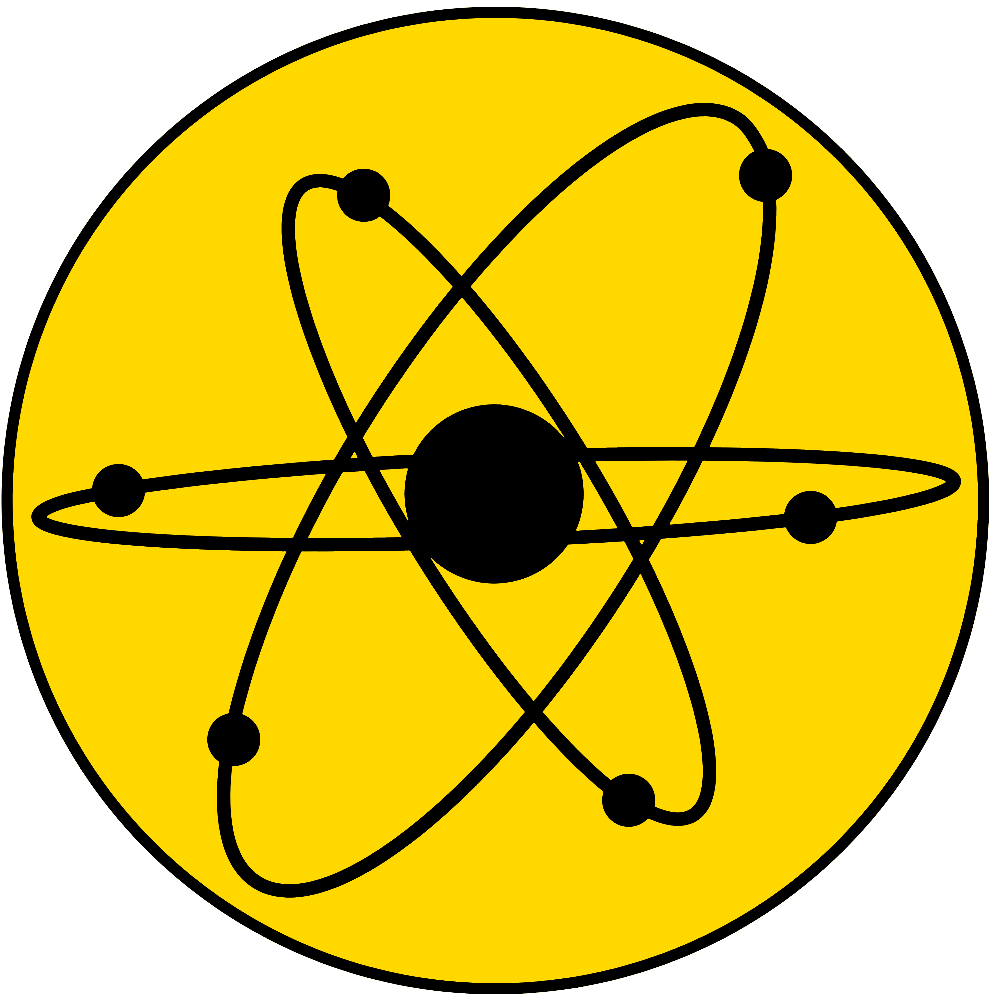

[![Contributors][contributors-shield]][contributors-url]
[![Forks][forks-shield]][forks-url]
[![Stargazers][stars-shield]][stars-url]
[![Issues][issues-shield]][issues-url]
[![MIT License][license-shield]][license-url]
[![LinkedIn][linkedin-shield]][linkedin-url]

<!-- PROJECT LOGO -->
 

  

  <h3 align="center">Physics faculty website</h3>

  

    <a href="https://physics.bsu.by"><strong>Explore »</strong></a>
     
     
    <a href="https://github.com/IlyshaNil/bsuphys">View Demo</a>
    ·
    <a href="https://github.com/IlyshaNil/bsuphys/issues">Report Bug</a>
    ·
    <a href="https://github.com/IlyshaNil/bsuphys/issues">Request Feature</a>
  

<!-- TABLE OF CONTENTS -->

  
Table of Contents

  <ol>
    <li><a href="#about-the-project">About The Project</a></li>
    <li><a href="#built-with">Built With</a></li>
    <li><a href="#roadmap">Roadmap</a></li>
    <li><a href="#contributing">Contributing</a></li>
  </ol>

### Built With

* [Nginx](https://nginx.org/ru/)
* [Django](https://www.djangoproject.com/)
* [PostgreSQL](https://www.postgresql.org/)
* [Gunicorn](https://gunicorn.org/)
* [Jenkins](https://www.jenkins.io/)

(<a href="#top">back to top</a>)

<!-- ROADMAP -->
## Roadmap

- [ ] Add CI/CD
- [ ] Add admin panel features
- [ ] Add Additional Templates
- [ ] Add 
- [ ] Multi-language Support

See the [open issues](https://github.com/othneildrew/Best-README-Template/issues) for a full list of proposed features (and known issues).

(<a href="#top">back to top</a>)

<!-- CONTRIBUTING -->
## Contributing

Contributions are what make the open source community such an amazing place to learn, inspire, and create. Any contributions you make are **greatly appreciated**.

If you have a suggestion that would make this better, please fork the repo and create a pull request. You can also simply open an issue with the tag "enhancement".
Don't forget to give the project a star! Thanks again!

1. Fork the Project
2. Create your Feature Branch (`git checkout -b feature/AmazingFeature`)
3. Commit your Changes (`git commit -m 'Add some AmazingFeature'`)
4. Push to the Branch (`git push origin feature/AmazingFeature`)
5. Open a Pull Request

(<a href="#top">back to top</a>)

<!-- MARKDOWN LINKS & IMAGES -->
<!-- https://www.markdownguide.org/basic-syntax/#reference-style-links -->
[contributors-shield]: https://img.shields.io/github/contributors/IlyshaNil/bsuphys.svg?style=for-the-badge
[contributors-url]: https://github.com/IlyshaNil/bsuphys/graphs/contributors
[forks-shield]: https://img.shields.io/github/forks/IlyshaNil/bsuphys.svg?style=for-the-badge
[forks-url]: https://github.com/IlyshaNil/bsuphys/network/members
[stars-shield]: https://img.shields.io/github/stars/IlyshaNil/bsuphys.svg?style=for-the-badge
[stars-url]: https://github.com/IlyshaNil/bsuphys/stargazers
[issues-shield]: https://img.shields.io/github/issues/IlyshaNil/bsuphys.svg?style=for-the-badge
[issues-url]: https://github.com/IlyshaNil/bsuphys/issues
[license-shield]: https://img.shields.io/github/license/IlyshaNil/bsuphys.svg?style=for-the-badge
[license-url]: https://github.com/IlyshaNil/bsuphys/LICENSE.txt
[linkedin-shield]: https://img.shields.io/badge/-LinkedIn-black.svg?style=for-the-badge&logo=linkedin&colorB=555
[linkedin-url]: https://www.linkedin.com/in/ilya-nilov-b7b9201b4/
[product-screenshot]: https://raw.githubusercontent.com/IlyshaNil/bsuphys/master/static/screen.PNG
